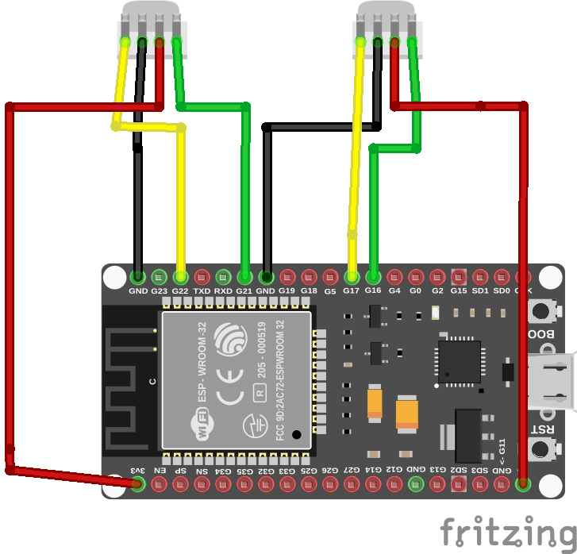
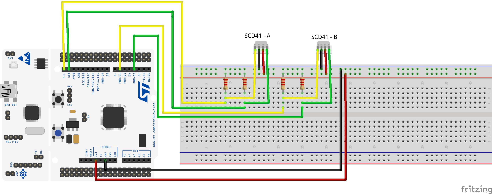
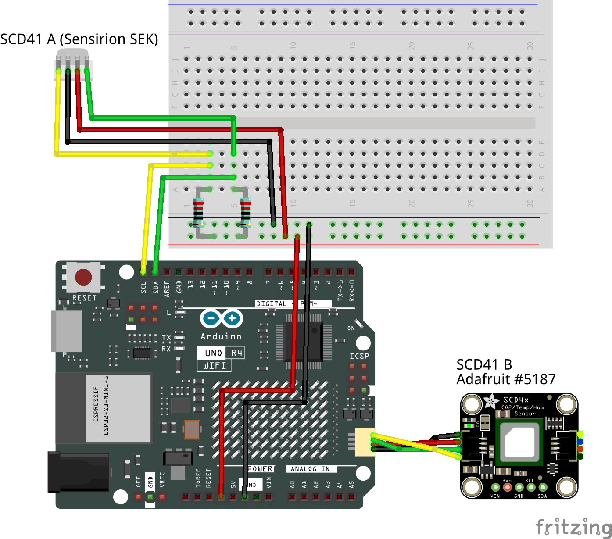

# Introduction

You have a micro controller and two identical sensors, meaning that they have the same I2C address. Without a multiplexer
or the possibility to configure the I2C address of the sensor, you cannot attach them to the same I2C bus. However, on a
board that provides the ability to configure any GPIO pin pairs as an I2C bus, you can connect the two sensors to their
own individual I2C buses. In this article, we will explain how to set up separate I2C buses for each sensor for a few different boards.

# General working principle

The two SCD41 sensors we want to connect have an I2C address of 0x62, which cannot be changed. Therefore, to communicate
with both sensors from the micro controller, we will use a separate I2C bus for each. Each I2C bus requires one pin for
the SDA line and one for the SCL line. Depending on the board and library implementation, we can either use pre-configured
instances of the `Wire` library or we need to create our own instances of the `TwoWire` class and assign the pins used for 
SDA and SCL lines. As a final step, we will create two instances of our sensor driver class and
initialize one with the first I2C bus and the other with the second I2C bus.

# ESP32 DevKitC

## Wiring

First, we need to define the pins we will use for the two I2C buses. For I2C bus A, we can use the default I2C pins
of the board. For the ESP32 DevKitC, these are pin 21 (SCL) and pin 22 (SDA). For I2C bus B, we can choose any two
GPIO (General Purpose Input Output) pins.

If you are using a different board, it is important to check the specifications to determine if any pins have special
configurations that prevent them from being used as GPIO pins. In our case, we have selected pins 17 and 16 for
I2C bus B.

### Pull-up resistors

Having pull-up resistors in place on the I2C data (SDA) and clock (SCL) lines is important to have a good signal quality and robust communication.
You can read more about it on [I2C Pull-Up Resistors Intro](i2c-pull-up-resistors-intro.md)

The ESP32 DevKitC Board ensures that GPIO lines are automatically pulled to a high state. Therefore, there is no need to
manually wire or configure pull-up resistors for the pins you intend to use.

### Wiring diagram

Since the SCD41 sensor is compatible with both 3.3V and 5V, we can connect one sensor to the 3.3V pin and the other to
the 5V pin. If both sensors require the same voltage, they can be connected through a breadboard.

For this example, the wiring should be carried out as follows:




| Sensor board        | ESP32  | Cable color | Description |
|---------------------|--------|-------------|-------------|
| SEK-SCD41 A - Pin 1 | Pin 22 | yellow | SCL    |
| SEK-SCD41 A - Pin 2 | GND    | black | Ground |
| SEK-SCD41 A - Pin 3 | 3V3    | red | Sensor supply voltage 3-5V | 
| SEK-SCD41 A - Pin 4 | Pin 21 | green | SDA |  
| SEK-SCD41 B - Pin 1 | Pin 17 | yellow | SCL |
| SEK-SCD41 B - Pin 2 | GND | black | Ground |
| SEK-SCD41 B - Pin 3 | 5V | red | Sensor supply voltage 3-5V | 
| SEK-SCD41 B - Pin 4 | Pin 16 | green | SDA |

When configuring the software later on, it is important to remember the pins allocated for the second I2C bus.
Specifically, we used pin 17 for the I2C clock (SCL) and pin 16 for the I2C data (SDA).

## Software setup

First, you need to include the Wire library:

```
#include <Wire.h>
```

We are using the Arduino ESP32 platform, which includes the `Wire` library, that is already configured for
the default I2C bus on pins 21/22.
We can use the `Wire` instance without any modification for the sensor attached to the "I2C bus A" (default I2C bus).
We just need to initialize the bus with:

```
Wire.begin();
```

For the "I2C bus B" we need to configure a custom `TwoWire` instance. There is a predefined instance named `Wire1` we
can configure to use the pins we defined with the following lines of code within the `setup()` function:

```
const int sda_B = 16;
const int scl_B = 17;
Wire1.begin(sda_B, scl_B);
```

Then, the code sending the commands to the sensors over the I2C bus needs to know which bus to use for which sensor.
Thus, you need to configure the sensor instances accordingly. First, create a driver instance per sensor.
Their scope should be global, such that those can be referred to from within `setup()` and `loop()`.

```
SensirionI2cScd4x sensorA;
SensirionI2cScd4x sensorB;
```

Then, in the `setup()` function, assign the I2C buses to the sensors:

```
sensorA.begin(Wire, SCD41_I2C_ADDR_62);
sensorB.begin(Wire1, SCD41_I2C_ADDR_62);
```

Look out that you really have `Wire1` assigned for sensorB, so that it uses the custom set-up I2C bus.

You can now send any I2C command to the sensor, such as initiating the measurement and retrieving values.

```
sensorA.startMeasurement();
sensorB.startMeasurement();
...
```

You can find more details and options how to configure several I2C buses on the ESP32 platform using the Arduino IDE under [ESP32 I2C Tutorial](https://randomnerdtutorials.com/esp32-i2c-communication-arduino-ide/)


## Example sketch

You find a complete example under [exampleESP32DevKitCV4](exampleESP32DevKitCV4/exampleESP32DevKitCV4.ino)

# STM32 Nucleo 64 Board

## Wiring 

The STM32 Nucleo 64 board has pre-defined I2C pins. We use I2C1 (SDA on pin 14, SCL on pin 15) and 
I2C2 (SDA on pin 3, SCL on pin 6). 

### Pull Ups

Having pull-up resistors in place on the I2C data (SDA) and clock (SCL) lines is important to have a good signal quality and robust communication.
You can read more about it on [I2C Pull-Up Resistors Intro](i2c-pull-up-resistors-intro.md)

The Nucleo board nor the development kit board has pull-up resistors built in.
Thus, we need to wire a resistor into each of the I2C communication lines. Four 8.26kOhm resistors were used in
this example and the wiring was done using a bread board so that no soldering was needed.

### Wiring diagram


Names R.1 to R.4 stand for resistors with a value of 8.26kOhm.

| Sensor Board / Resistor   | STM32 Nucleo 64 / Resistor | Cable color | Description |
|--------------------------------|----------------------------|-------------|-------------|
| SEK-SCD41 A Pin 1 | R.1 | yellow | SCL |
| R.1 | Nucleo Pin 15 | yellow | SCL |
| R.1 | Nucleo 3V3 |  | Reference Voltage |
| SEK-SCD41 A Pin 2 | Nucleo GND | black |Ground |
| SEK-SCD41 A Pin 3 | Nucleo 3V3 | red | Sensor Supply Voltage 3-5V | 
| SEK-SCD41 A Pin 4 | R.2 | green | SDA |
| R.2 | Nucleo Pin 14 | green | SDA |
| R.2 | Nucleo 3V3 | | Reference Voltage |
| SEK-SCD41 B Pin 1 | R.3 | yellow | SCL |
| R.3 | Nucleo Pin 6 | yellow | SCL |
| R.3 | Nucleo 3V3 | | Reference Voltage |
| SEK-SCD41 B Pin 2 | Nucleo GND | black | Ground |
| SEK-SCD41 B Pin 3 | Nucleo 5V | red | Sensor supply voltage 3-5V |
| SEK-SCD41 B Pin 4 | R.4 | green | SDA |
| R.4 | Nucleo Pin 3 | green | SDA|
| R.4 | Nucleo 3V3 | | Reference Voltage |

What we have to remember for the configuration in the software later is the pins we used for the I2C buses.

## Software setup

First, you need to include the Wire library:

```
#include <Wire.h>
```

For configuring the I2C buses with the correct pins, we need to instantiate two TwoWire instances and pass 
the pins to be used for the I2C communication.
Their scope should be global, thus the definition is outside `setup()` and `loop()`.

```
// I2C Bus A on Pins 14 (SDA) / 15 (SCL)
const int sda_A = 14;
const int scl_A = 15;
TwoWire i2cBusA(sda_A, scl_A);

// I2C Bus B on Pins 3 (SDA) / 6 (SCL)
const int sda_B = 3;
const int scl_B = 6;
TwoWire i2cBusB(sda_B, scl_B);
```

Then, the code sending the commands to the sensors over the I2C Bus needs to know which bus to use for which sensor.
Thus, you need to configure the sensors instances accordingly. First, create a driver instance per sensor.
Their scope should be global, such that they can be referred to from within `setup()` and `loop()`.

```
SensirionI2cScd4x sensorA;
SensirionI2cScd4x sensorB;
```

Then, in the `setup()` function, assign the I2C Buses to the sensors:

```
sensorA.begin(i2cBusA, SCD41_I2C_ADDR_62);
sensorB.begin(i2cBusB, SCD41_I2C_ADDR_62);
```

You can now send any I2C command to the sensor, such as initiating the measurement and retrieving values.
The complete example code is provided in the link.

```
sensorA.startMeasurement();
sensorB.startMeasurement();
...
```

## Example sketch

You find a complete example under [exampleSTM32Nucleo64](exampleSTM32Nucleo64/exampleSTM32Nucleo64.ino).

# Arduino Uno R4 WIFI

## Wiring

The Arduino Uno R4 WIFI provides one I2C bus on the pin header, which has no pull-ups on the board.
Thus, we need to connect a pull up resistor between SDA and VDD and SCL and VDD. 
In the example two 2.2kOhm resistors were used.

The second I2C bus is on the Qwiic. We use here the breakout board from Adafruit.
The board includes 10K pull-up on SDA and SCL.

### Pull Ups

Having pull-up resistors in place on the I2C data (SDA) and clock (SCL) lines is important to have a good signal quality and robust communication.
You can read more about it on [I2C Pull-Up Resistors Intro](i2c-pull-up-resistors-intro.md)

The Arduino Uno R4 WIFI provides no pull-ups on the board.

The SEK SCD41 board we are going to connect to the I2C Bus on the pin header has no pull-up resistors built in.
Thus, we need to connect a pull-up resistor between SDA and VDD and SCL and VDD. Two 8.26kOhm resistors were used in
this example and the wiring was done using a bread board so that no soldering was needed.

The second sensor is on a Adafruit breakout board. This one includes a pull-up resistor. Thus,
no pull-up resistors have to be wired into this connection, for which a Qwiic cable is used.

### Wiring diagram



The list below describes the wiring, where R.1 and R.2 are resistors with a value of 8.26kOhm.

| Sensor board / Resistor | Arduino / Resistor  | Cable color | Description |
|-------------------------|---------------------|-------------|-------------|
| SEK-SCD41 Pin 1 | R.1 | yellow | SCL |
| R.1 | Arduino Pin SCL |yellow | SCL |
| R.1 | Arduino 3V3 | | I2C reference voltage |
| SEK-SCD41 Pin 2 | Arduino GND | Ground |
| SEK-SCD41 Pin 3 | Arduino 3V3 | Sensor supply voltage 3-5V |
| SEK-SCD41 Pin 4 | R.2 | green | SDA |
| R.2 | Arduino Pin 14 | green | SDA |
| R.2 | Arduino 3V3 | | I2C reference voltage |
| Adafruit SCD41 (includes Pull-Ups) | Arduino Qwiic connector | | Qwiic cable with SCL, GND, VDD, SDA lines |


## Software setup

First, you need to include the Wire library:

```
#include <Wire.h>
```

For the Arduino Uno R4, this library defines two I2C buses. The first, "Wire" is configured 
for the SDA/SCL pins on the pin header, where "Wire1" is configured for the Qwiic connector.
We can use those two instances without any further configuration. You just need to initialize them:

```
Wire.begin();
Wire1.begin();
```

Then, the code sending the commands to the sensors over the I2C bus needs to know which bus to use for which sensor.
Thus, you need to configure the sensor instances accordingly. First, create a driver instance per sensor.
Their scope should be global, such that those can be referred to from within `setup()` and `loop()`.

```
SensirionI2cScd4x sensorOnPins;
SensirionI2cScd4x sensorOnQwiic;
```

Next, in the `setup()` function, assign the I2C buses to the sensors:

```
sensorOnPins.begin(Wire, SCD41_I2C_ADDR_62);
sensorOnQwiic.begin(Wire1, SCD41_I2C_ADDR_62);
```

Look out that you really have `Wire1` assigned for `sensorOnQwiic`.

You can now send any I2C command to the sensor, such as initiating the measurement and retrieving values.
The complete example code is provided in the link.

```
sensorOnPins.startMeasurement();
sensorOnQwiic.startMeasurement();
...
```


## Example sketch

You find a complete example under [exampleArduinoUnoR4](exampleArduinoUnoR4/exampleArduinoUnoR4.ino).

# Other Arduino Boards

Documentation for Arduino boards can be found under [Arduino Wire Library](https://docs.arduino.cc/language-reference/en/functions/communication/wire/).

Note that not all boards support multiple I2C buses and that it is recommended to use a custom pull-up resistor configuration,
as the built in resistors are likely not strong enough (resistor value is too big).

