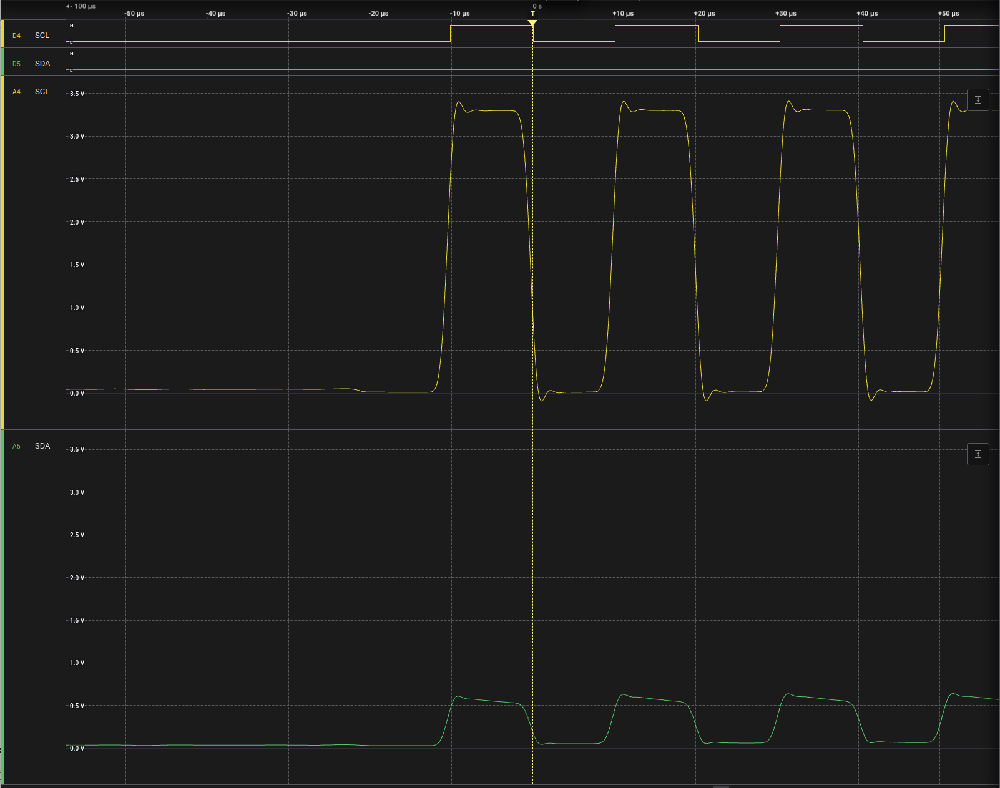

# Introduction

You have a microcontroller and two identical sensors, meaning that they have the same I2C address. Without a multiplexer
or the possibility to configure the I2C address of the sensor, you cannot attach them to the same I2C bus. However, on a
board that provides the ability to configure any GPIO pin pairs as an I2C bus, you can connect the two sensors to their
own individual I2C buses. In this article, we will explain how to set up separate I2C buses for each sensor.

# The Ingredients

In this example, we use an ESP32, which supports multiple I2C buses. You can use any two sensors, whether they are the
same product or different sensors with the same I2C address. For this example, we will use two Sensirion SCD41 CO2
sensors. To connect the sensors with cables without soldering, we use the Sensirion Development Kit Boards for the
SCD41.

# General working principle

The two SCD41 sensors we want to connect have an I2C address of 0x62, which cannot be changed. Therefore, to communicate
with both sensors from the microcontroller, we will use a separate I2C bus for each. Each I2C bus requires one pin for
the SDA line and one for the SCL line. The first sensor will be attached to the standard I2C pins. For the second I2C
bus, we need to define two GPIO pins to use and connect the second sensor to those pins. On the software side, you can
use the standard "Wire" library for the first sensor connected to the default pins. For the second sensor, we will need
to configure it to use the chosen pins. As a final step, we will create two instances of our sensor driver class and
initialize one with the standard I2C bus and the other with the custom I2C bus.

# Pull Up Resistors on I2C Lines

When examining the I2C protocol, you will observe that the I2C SCL and SDA lines remain in a high state when idle.
When the I2C leader or follower communicate, they pull the line to a low state. To return the lines to a
high state, external components known as pull-up resistors are required. Without these pull-ups, the lines would be left
floating, resulting in an undefined state. This leads to incorrect detection of the low state and introduces
errors in your communication.

Having pull-up resistors in place is essential for ensuring good signal quality and reliable data exchange. If you are
experiencing unreliable communication, such as sporadic data dropouts or only receiving part of the data, it is
advisable to check the pull-up resistor configuration.

Where can pull-up resistors be placed:

1. On the development board you are connecting.
2. On the microcontroller.
3. Manually wired on the SDA and SCL lines between the microcontroller and development board, for example, by using a
   breadboard.

So if your development board or microcontroller has pull-ups built-in, you should be good to go.
For example, the ESP32 DevKit 4 has pull-ups built-in, but the STM32 Nucleo does not.

Pull-up resistors are connected from the SDA and SCL lines to the positive supply voltage. Standard resistor values are
4.7 kΩ or 10 kΩ. You may also find an optimal pull-up resistor value for your sensor in the sensor or development board
datasheet.

If there are pull-up resistors on both the board and the microcontroller, the pull-up resistances are in parallel,
resulting in a lower overall value. This could potentially lead to a pull-up resistance that is too small, causing your
devices to fail to drive the lines to the low level reliably.

The pull-up resistance value depends on various factors. If you can log the signals with a logic analyzer or
oscilloscope, you can check that the waveform of your I2C signals has sharp edges, indicating that your resistor setup
is appropriate.

For example, you observe the signal of a SEK SCD41 connected to a Nucleo 64 board. Neither the SEK SCD41 nor the STM
Nucleo 64 board includes pull-up resistors. Therefore, we need to connect a resistor between VDD and each SDA/SCL line,
requiring one resistor per line.

**Too low** If you have resistance that is too low or has no pull-ups, the lines will be floating.
In the setup here, you can observe that both lines are low (0V) in the idle state. When the I2C leader attempts to
communicate, you may see some signal, but the SDA line is essentially just following the clock signal.

Trace of setup with no resistors:


**Good** If your resistors are properly dimensioned, the signal shape will appear more rectangular. The lower the
resistor value, the sharper the rectangular shape should be.
Also, note that at the beginning of the trace, you can observe that both the SDA and SCL lines are in a high state (~
3.3V).

Trace of setup with 2.2kOhm resistors:


**Too big** If your resistor values are too large, the signal may take too long to recover to the high state and may not
reach the maximum voltage anymore (the maximum voltage reached in the trace during communication is approximately 3.1V).

Trace of setup with 18kOhm resistors:


# ESP32 DevKitC - Wiring & Software Setup

First, we need to define the pins we will use for the two I2C buses. For I2C bus A, we can use the default I2C pins
of the board. For the ESP32 DevKitC, these are pin 21 (SCL) and pin 22 (SDA). For I2C bus B, we can choose any two
GPIO (General Purpose Input Output) pins.

If you are using a different board, it is important to check the specifications to determine if any pins have special
configurations that prevent them from being used as GPIO pins. In our case, we have selected pins 17 and 16 for
I2C bus B.

Since the SCD41 sensor is compatible with both 3.3V and 5V, we can connect one sensor to the 3.3V pin and the other to
the 5V pin. If both sensors require the same voltage, they can be connected through a breadboard.

For this example, the wiring should be carried out as follows:


    SEK-SCD41 A - Pin 1 to ESP32 Pin 22 (SCL, yellow cable)
    SEK-SCD41 A - Pin 2 to ESP32 GND (Ground, black cable)
    SEK-SCD41 A - Pin 3 to ESP32 3V3 (Sensor supply voltage, red cable)
    SEK-SCD41 A - Pin 4 to ESP32 Pin 21 (SDA, green cable)


    SEK-SCD41 B - Pin 1 to ESP32 Pin 17 (SCL, yellow cable)
    SEK-SCD41 B - Pin 2 to ESP32 GND (Ground, black cable)
    SEK-SCD41 B - Pin 3 to ESP32 5V (Sensor supply voltage, red cable)
    SEK-SCD41 B - Pin 4 to ESP32 Pin 16 (SDA, green cable)

When configuring the software later on, it is important to remember the pins allocated for the second I2C bus.
Specifically, we used pin 17 for the I2C clock (SCL) and pin 18 for the I2C data (SDA).

The ESP32 DevKitC Board ensures that GPIO lines are automatically pulled to a high state. Therefore, there is no need to
manually wire or configure pull-up resistors for the pins you intend to use.

We are using the Arduino ESP32 platform, which includes the "Wire" library, that is already configured for
the default I2C bus on pins 21/22.
We can use the Wire instance without any modification for the sensor attached to the "I2C bus A" (default I2C bus).

For the "I2C bus B" we need to configure a custom "TwoWire" instance. There is a predefined instance named "Wire1" we
can configure to use the pins we defined with the following lines of code within the `setup()` function:

```
const int sda_B = 16;
const int scl_B = 17;
Wire1.begin(sda_B, scl_B);
```

Then, the code sending the commands to the sensors over the I2C bus needs to know which bus to use for which sensor.
Thus, you need to configure the sensor instances accordingly. First, create a driver instance per sensor.
Their scope should be global, such that those can be referred to from within `setup()` and `loop()`.

```
SensirionI2cScd4x sensorA;
SensirionI2cScd4x sensorB;
```

Then, in the `setup()` function, assign the I2C buses to the sensors:

```
sensorA.begin(Wire, SCD41_I2C_ADDR_62);
sensorB.begin(Wire1, SCD41_I2C_ADDR_62);
```

Look out that you really have `Wire1` assigned for sensorB, so that it uses the custom set-up I2C bus.

You can now send any I2C command to the sensor, such as initiating the measurement and retrieving values.
The complete example code is provided in the link.

```
sensorA.startMeasurement();
sensorB.startMeasurement();
...
```

# STM32 Nucleo 64 Board

The STM32 Nucleo 64 board has pre-defined I2C pins. We use I2C1 (SDA on pin 14, SCL on pin 15) and 
I2C2 (SDA on pin 3, SCL on pin 6). The Nucleo board nor the development kit board has pull-up resistors built in.
Thus, we need to wire a resistosr in to each of the I2C communication lines. This can be done for example 
by using a bread board so that no soldering is needed.


Names R.1 to R.4 stand for resistors with a value of 2.2kOhm.

    SEK-SCD41 A Pin 1 to R.1 (SCL, yellow)
    R.1 to Nucleo Pin 15 (SCL, yellow)
    R.1 to Nucleo 3V3
    SEK-SCD41 A Pin 2 to Nucleo GND
    SEK-SCD41 A Pin 3 to Nucleo 3V3
    SEK-SCD41 A Pin 4 to R.2 (SDA, green)
    R.2 to Nucleo Pin 14 (SDA, green)
    R.2 to Nucleo 3V3

    SEK-SCD41 B Pin 1 to R.3 (SCL, yellow)
    R.3 to Nucleo Pin 6 (SCL, yellow)
    R.3 to Nucleo 3V3
    SEK-SCD41 B Pin 2 to ESP32 GND (Ground, black cable)
    SEK-SCD41 B Pin 3 to ESP32 5V (Sensor supply voltage, red cable)
    SEK-SCD41 B Pin 4 to R.4 (SDA, green)
    R.4 to Nucleo Pin 3 (SDA, green)
    R.4 to Nucleo 3V3

What we have to remember for the configuration in the software later is the pins we used for the I2C Buses.

For configuring the I2C buses with the correct pins, we need to instantiate two TwoWire instances and pass 
the pins to be used for the I2C communication.
Their scope should be global, thus the definition is outside `setup()` and `loop()`.

```
// I2C Bus A on Pins 14 (SDA) / 15 (SCL)
const int sda_A = 14;
const int scl_A = 15;
TwoWire i2cBusA(sda_A, scl_A);

// I2C Bus B on Pins 3 (SDA) / 6 (SCL)
const int sda_B = 3;
const int scl_B = 6;
TwoWire i2cBusB(sda_B, scl_B);
```

Then, the code sending the commands to the sensors over the I2C Bus needs to know wich bus to use for which sensor.
Thus, you need to configure the sensors instances accordingly. First, create a driver instance per sensor.
Their scope should be global, such that they can be refered to from within `setup()` and `loop()`.

```
SensirionI2cScd4x sensorA;
SensirionI2cScd4x sensorB;
```

Then, in the `setup()` function, assign the I2C Buses to the sensors:

```
sensorA.begin(i2cBusA, SCD41_I2C_ADDR_62);
sensorB.begin(i2cBusB, SCD41_I2C_ADDR_62);
```

You can now send any I2C command to the sensor, such as initiating the measurement and retrieving values.
The complete example code is provided in the link.

```
sensorA.startMeasurement();
sensorB.startMeasurement();
...
```

# Other Boards - Wiring & Software setup

For other Arduino boards, you find the default I2C wiring on: https://docs.arduino.cc/learn/communication/wire/

Depending on your board and the implementation, there is a second Wire1 object predefined. If not, you have to dig one
layer deeper and instantiate a TwoWire object and assign the correct pins. There is a good explanation with different
variants for the ESP32 boards using the Arduino
IDE: https://randomnerdtutorials.com/esp32-i2c-communication-arduino-ide/
