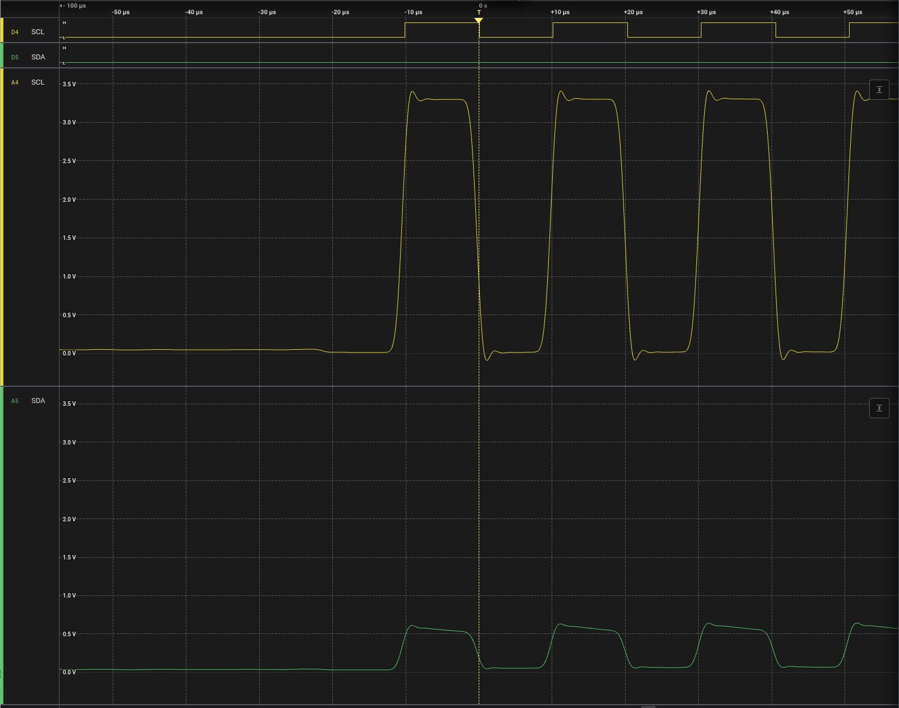
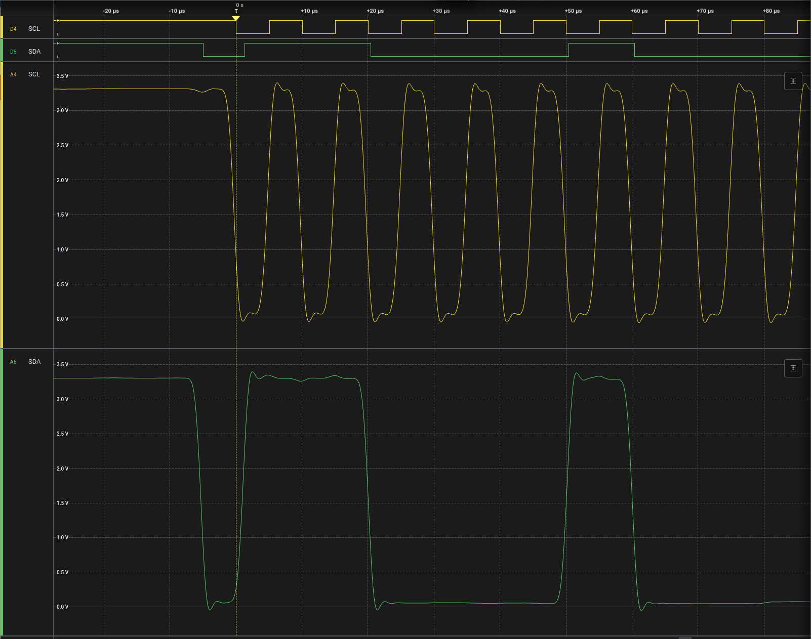
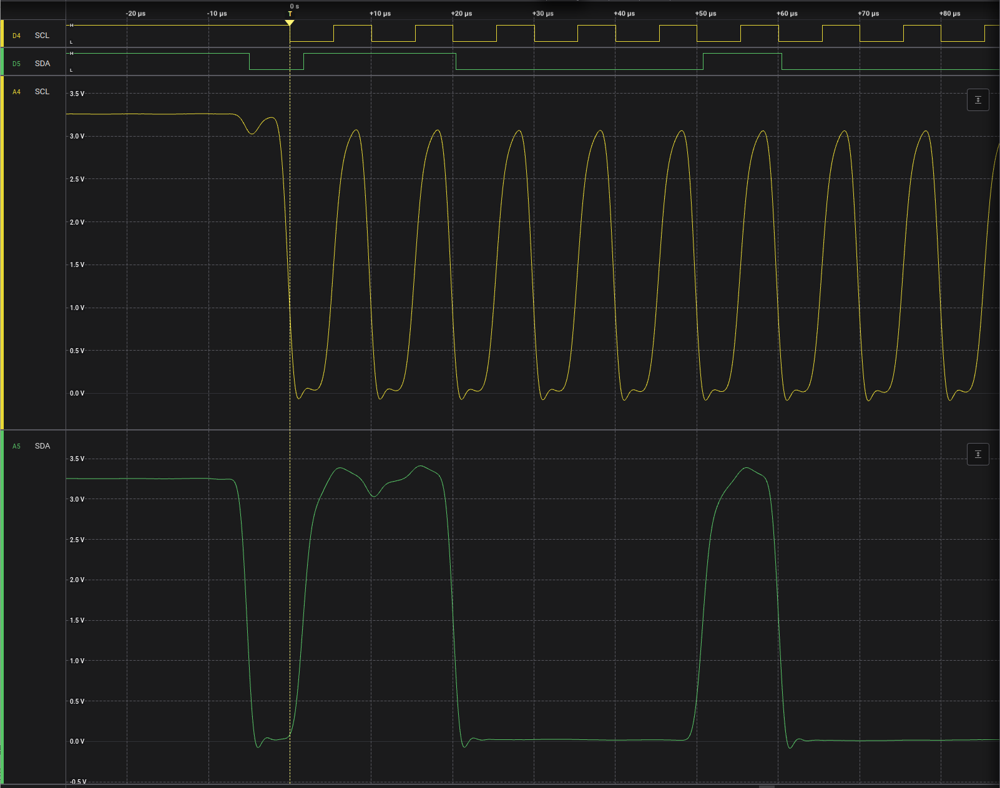
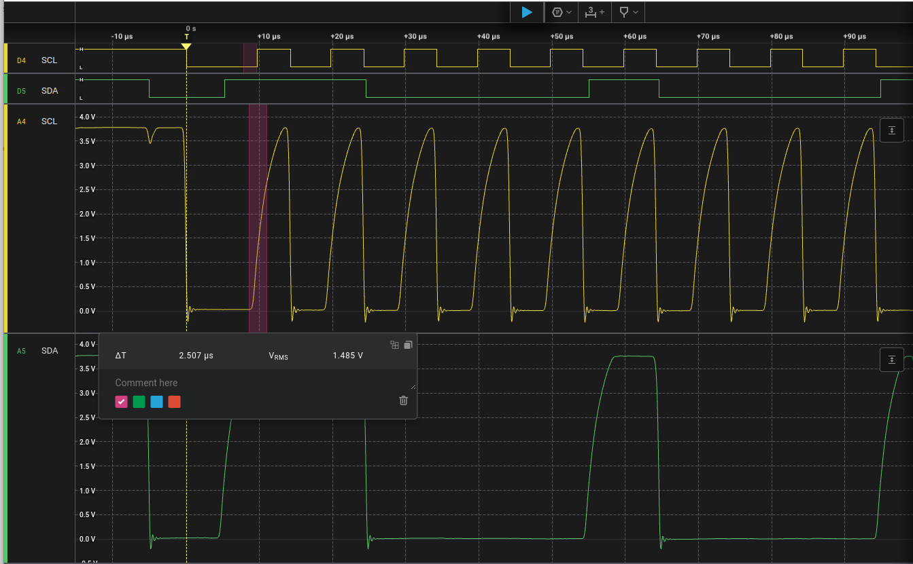
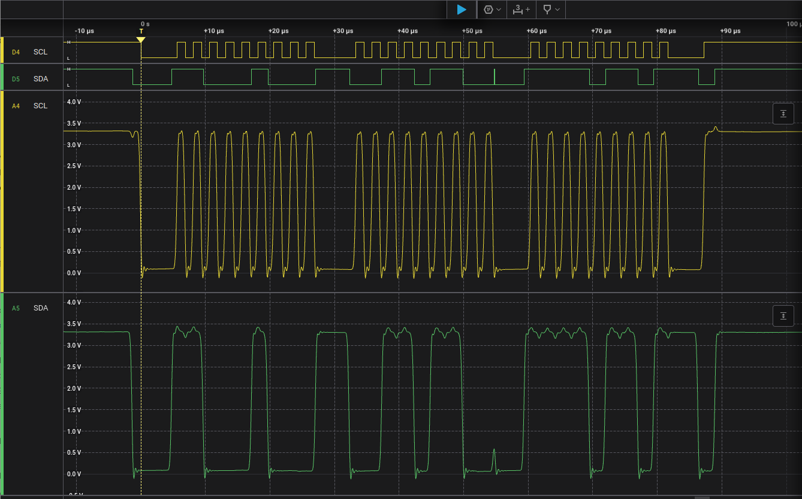
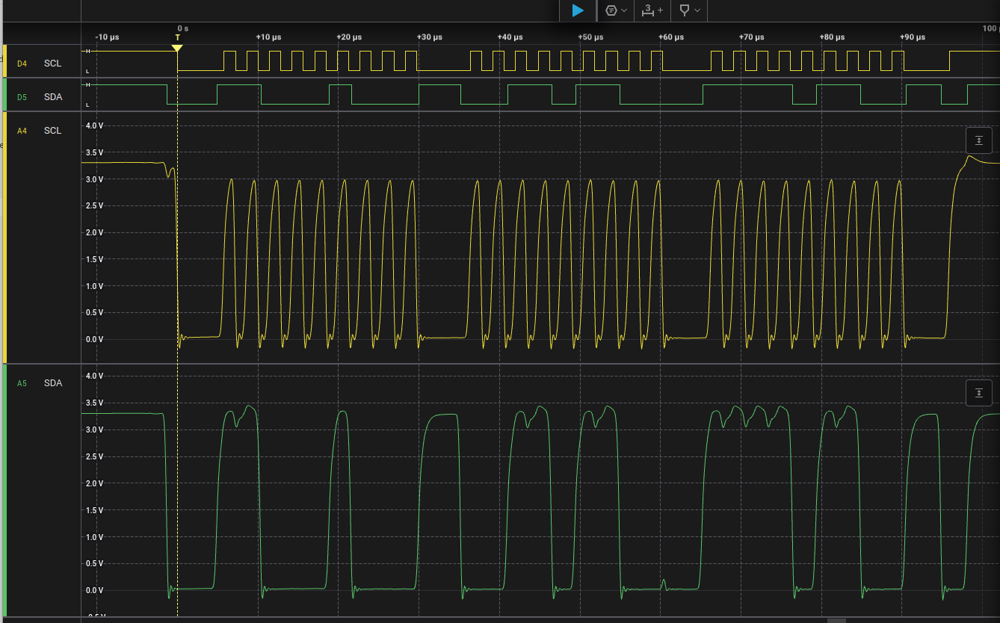
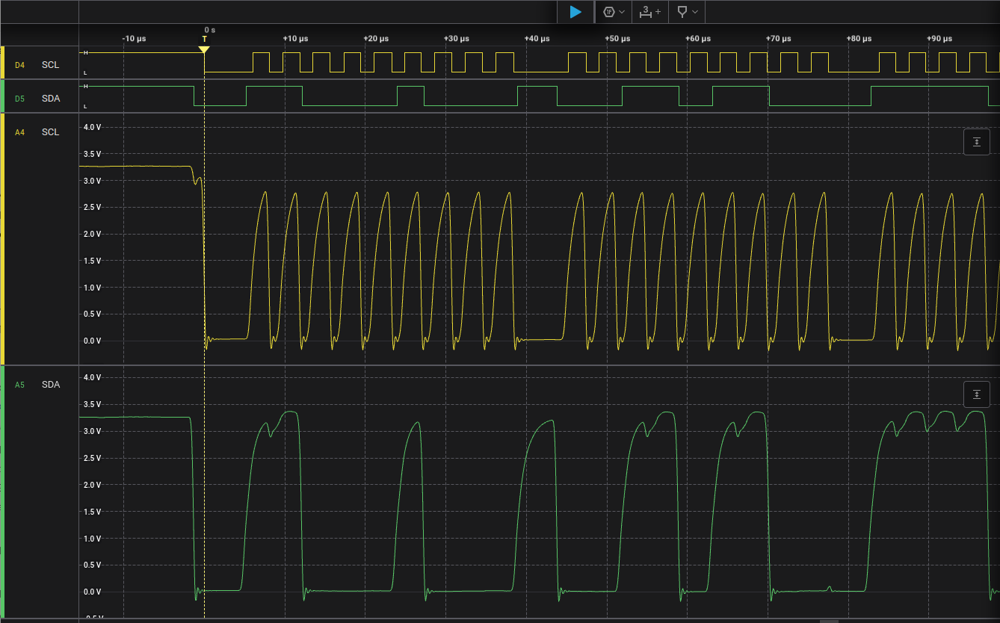

# Pull Up Resistors on I2C Lines

When examining the I2C protocol, you will observe that the I2C SCL and SDA lines remain in a high state when idle.
When the I2C leader or follower communicate, they pull the line to a low state. To return the lines to a
high state, external components known as pull-up resistors are required. Without these pull-ups, the lines would be left
floating, resulting in an undefined state. This leads to incorrect detection of the low state and introduces
errors in your communication.

Having pull-up resistors in place is essential for ensuring good signal quality and reliable data exchange. If you are
experiencing unreliable communication, such as sporadic data dropouts or only receiving part of the data, it is
advisable to check the pull-up resistor configuration.

Where can pull-up resistors be placed:

1. On the development board you are connecting.
2. On the microcontroller.
3. Manually wired on the SDA and SCL lines between the microcontroller and development board, for example, by using a
   breadboard.

So if your development board or microcontroller has pull-ups built-in, you should be good to go.
For example, the ESP32 DevKit 4 has pull-ups built-in, but the STM32 Nucleo does not.

Pull-up resistors are connected from the SDA and SCL lines to the positive supply voltage. Standard resistor values are
4.7 kΩ or 10 kΩ. You may also find an optimal pull-up resistor value for your sensor in the sensor or development board
datasheet.

If there are pull-up resistors on both the board and the microcontroller, the pull-up resistances are in parallel,
resulting in a lower overall value. This could potentially lead to a pull-up resistance that is too small, causing your
devices to fail to drive the lines to the low level reliably.

The pull-up resistance value depends on various factors. If you can log the signals with a logic analyzer or
oscilloscope, you can check that the waveform of your I2C signals has sharp edges, indicating that your resistor setup
is appropriate.

For example, you observe the signal of a SEK SCD41 connected to a Nucleo 64 board. Neither the SEK SCD41 nor the STM
Nucleo 64 board includes pull-up resistors. Therefore, we need to connect a resistor between VDD and each SDA/SCL line,
requiring one resistor per line.

**Too low** If you have resistance that is too low or has no pull-ups, the lines will be floating.
In the setup here, you can observe that both lines are low (0V) in the idle state. When the I2C leader attempts to
communicate, you may see some signal, but the SDA line is essentially just following the clock signal.

Trace of setup with no resistors:


**Good** If your resistors are properly dimensioned, the signal shape will appear more rectangular. The lower the
resistor value, the sharper the rectangular shape should be.
Also, note that at the beginning of the trace, you can observe that both the SDA and SCL lines are in a high state (~
3.3V).

Trace of setup with 2.2kOhm resistors:


**Too big** If your resistor values are too large, the signal may take too long to recover to the high state and may not
reach the maximum voltage anymore (the maximum voltage reached in the trace during communication is approximately 3.1V).

Trace of setup with 18kOhm resistors:


# Arduino boards

Most of the Arduino boards do have pull-up resistors on the board which will be activated on the I2C pins when you call 
`Wire.begin()`. Those have however a high resistance value and are not appropriate for all setups. The internal pull-ups 
are likely too weak to recover the line fast enough to a high state, especially with faster I2C bus frequencies than 
the default of 100kHz. If pull ups are too weak, it might lead to unreliable or no communication over I2C.


With the internal pull-ups and 100kHz, I2C communication is working. The I2C signal is however not very good as there 
is no plateau on the high state, but rise time is still fast enough with 100kHz. 



If we switch to 400kHz, we cannot communicate anymore if the internal pull-ups are turned on. No signal was detected
anymore at all. You see in the screen shot above that if the clock speed would be 4 times faster, signal would have
to be on high state within the reddish box - which is far from 3V.

To solve the problem, you need to deactivate the internal pull up resistors and connect external pull up resistors.
Deactivating the internal pull up resistors is done in the code. Make sure to have those calls after the `Wire.begin()`,
as the begin configures the I2C pins to INPUT_PULLUP. Same is true for the I2C clock, you have to configure it after
the call to begin, as otherwise it will overwrite it with the default of 100kHz.

The code below was tested on a Arduino Nano. It turns off the internal pull ups and configures I2C fast mode with 400kHz
bus frequency. For other boards, you might need to adapt the pin names (here A4, A5).

```
Wire.begin();
Wire.setClock(400000L);
pinMode(A4, INPUT);
pinMode(A5, INPUT);
```

Choosing the correct pull-up resistor value is important. Further, short cables are also important for a good I2C signal,
as the capacitance of the cable also influences the rise time.

For an example how to wire external pull ups between SDA respectively SCL and VDD using a bread board please check out
the examples in the [README](README.md).

Following screenshots show the decrease in I2C signal quality depending on resistor values.
You can see that with the strong pull-up with 2.2kOhm resistor the signal looks quite rectangular.
With 8.3kOhm the pull-up is still just strong enough, but the signal has no plateau anymore.
Resistors of 18kOhm are too weak to pull-up the line fast enough into high state and the communication is not working anymore.

I2C bus frequency 400kHz, external pull-up resistors 2.2kOhm, good signal, communication is working:



I2C bus frequency 400kHz, external pull-up resistors 8.3kOhm, weak signal, communication is working:



I2C bus frequency 400kHz, external pull-up resistors 18kOhm, signal does not recover to high state, communication is **not** working:

